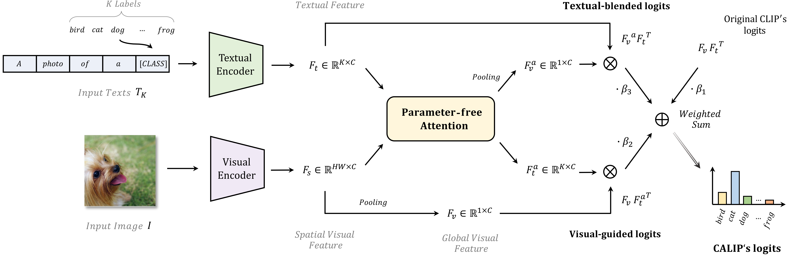

# CALIP: Zero-Shot Enhancement of CLIP with Parameter-free Attention
Official implementation of ['CALIP: Zero-Shot Enhancement of CLIP with Parameter-free Attention'](https://arxiv.org/pdf/2209.14169.pdf).

The paper has been accepted by **AAAI 2023**.

## Introduction
CALIP is a free-lunch enhancement method to boost CLIP’s zero-shot performance via a parameter-free Attention module. Specifically, we guide visual and textual representations to interact with each other and explore cross-modal informative features via attention. As the pre-training has largely reduced the embedding distances between two modalities, we discard all learnable parameters in the attention and bidirectionally update the multi-modal features, enabling the whole process to be parameter-free and training-free. In this way, the images are blended with textual-aware signals and the text representations become visual-guided for better adaptive zeroshot alignment. We evaluate CALIP on various benchmarks of 14 datasets for both 2D image and 3D point cloud few-shot classification, showing consistent zero-shot performance improvement over CLIP. Based on that, we further insert a small number of linear layers in CALIP’s attention module and verify our robustness under the few-shot settings, which also achieves leading performance compared to existing methods.
<div align="center">
  
</div>

## Requirements
### Installation
Create a conda environment and install dependencies:
```bash
git clone https://github.com/ZiyuGuo99/CALIP.git
cd CALIP

conda create -n calip python=3.7
conda activate calip

# Install the according versions of torch and torchvision
conda install pytorch torchvision cudatoolkit

pip install -r requirements.txt
```

### Dataset
Follow [DATASET.md](https://github.com/ZiyuGuo99/CALIP/blob/main/DATASET.md) to install ImageNet and other 10 datasets according to CoOp.

## Get Started
### Configs
The configuration for running on each dataset can be modified in `configs/*.yaml`. You need to fill in the `data_root` with your data path. Also, you can edit the settings of `backbone` and `search` as your need, and feel free to adjust `beta2` and `beta3` for a wider or finer search range. 

Note that the default `load_cache` is `False` for the first running, leading to storing the encoded features and labels. It can be set as `True` for faster hyperparamters tuning during later running.

### Running
For ImageNet dataset:
```bash
CUDA_VISIBLE_DEVICES=0 python run_imagenet.py --config configs/imagenet.yaml
```

For other 10 datasets:
TODO...

## Acknowledgement
This repo benefits from [CLIP](https://github.com/openai/CLIP), [CoOp](https://github.com/KaiyangZhou/Dassl.pytorch), [CLIP-Adapter](https://github.com/gaopengcuhk/CLIP-Adapter) and [Tip-Adapter](https://github.com/gaopengcuhk/Tip-Adapter). Thanks for their wonderful works.

## Citation
```bash
@article{guo2022calip,
  title={Calip: Zero-shot enhancement of clip with parameter-free attention},
  author={Guo, Ziyu and Zhang, Renrui and Qiu, Longtian and Ma, Xianzheng and Miao, Xupeng and He, Xuming and Cui, Bin},
  journal={arXiv preprint arXiv:2209.14169},
  year={2022}
}
```

## Contact
If you have any question about this project, please feel free to contact 2101210573@pku.edu.cn.
